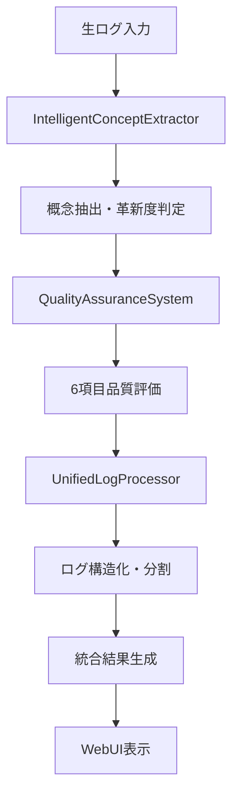
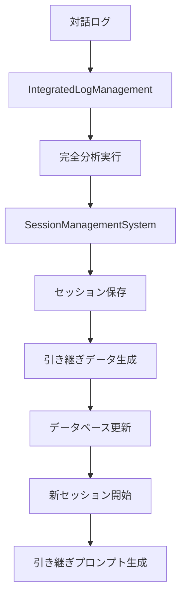

# システム概要

**Structured Dialogue Tools - 統合システムアーキテクチャ**

---

## 🏗️ システム全体像

### アーキテクチャ概念図
```
┌─────────────────────────────────────────────────────────────┐
│                     🌐 Web UI Layer                         │
│  ┌─────────────┐ ┌─────────────┐ ┌─────────────┐         │
│  │統一処理タブ │ │セッション管理│ │ダッシュボード│         │
│  └─────────────┘ └─────────────┘ └─────────────┘         │
└─────────────────────┬───────────────────────────────────────┘
                      │ HTTP API
┌─────────────────────┴───────────────────────────────────────┐
│                🚀 Application Layer                         │
│  ┌─────────────────────────────────────────────────────────┐│
│  │        📊 Integrated Log Management                     ││
│  │   ┌───────────┐ ┌───────────┐ ┌───────────┐          ││
│  │   │概念抽出   │ │品質保証   │ │命名提案   │          ││
│  │   └───────────┘ └───────────┘ └───────────┘          ││
│  └─────────────────────────────────────────────────────────┘│
│  ┌─────────────────────────────────────────────────────────┐│
│  │          💾 Session Management System                   ││
│  │   ┌───────────┐ ┌───────────┐ ┌───────────┐          ││
│  │   │セッション │ │引き継ぎ   │ │統計分析   │          ││
│  │   │保存・管理 │ │データ生成 │ │・検索     │          ││
│  │   └───────────┘ └───────────┘ └───────────┘          ││
│  └─────────────────────────────────────────────────────────┘│
└─────────────────────┬───────────────────────────────────────┘
                      │
┌─────────────────────┴───────────────────────────────────────┐
│                🧠 Core Engine Layer                         │
│  ┌─────────────────────────────────────────────────────────┐│
│  │     🧠 IntelligentConceptExtractor v4.0                ││
│  │   ┌───────────┐ ┌───────────┐ ┌───────────┐          ││
│  │   │75概念学習 │ │kuromoji   │ │革新度判定 │          ││
│  │   │データベース│ │形態素解析 │ │品質フィルタ│          ││
│  │   └───────────┘ └───────────┘ └───────────┘          ││
│  └─────────────────────────────────────────────────────────┘│
│  ┌─────────────────────────────────────────────────────────┐│
│  │        🛡️ Quality Assurance System                     ││
│  │   ┌───────────┐ ┌───────────┐ ┌───────────┐          ││
│  │   │6項目品質  │ │信頼性判定 │ │改善提案   │          ││
│  │   │メトリクス │ │リアルタイム│ │生成       │          ││
│  │   └───────────┘ └───────────┘ └───────────┘          ││
│  └─────────────────────────────────────────────────────────┘│
│  ┌─────────────────────────────────────────────────────────┐│
│  │          🏗️ Unified Log Processor                      ││
│  │   ┌───────────┐ ┌───────────┐ ┌───────────┐          ││
│  │   │ログ構造化 │ │チャンク   │ │統一書式   │          ││
│  │   │・分析     │ │位置づけ   │ │生成       │          ││
│  │   └───────────┘ └───────────┘ └───────────┘          ││
│  └─────────────────────────────────────────────────────────┘│
└─────────────────────┬───────────────────────────────────────┘
                      │
┌─────────────────────┴───────────────────────────────────────┐
│                📚 Data Layer                                │
│  ┌─────────────────────────────────────────────────────────┐│
│  │   📊 ANALYSIS_RESULTS_DB.json (75概念学習データ)       ││
│  │   💾 Session Database (JSON)                           ││
│  │   📁 Session Files (.md)                               ││
│  │   🔗 Handover Data (引き継ぎ情報)                       ││
│  └─────────────────────────────────────────────────────────┘│
└─────────────────────────────────────────────────────────────┘
```

---

## 🔄 データフロー

### 1. 統一処理フロー


### 2. セッション管理フロー


---

## 🧩 主要コンポーネント

### IntelligentConceptExtractor v4.0
**役割**: 核心概念抽出エンジン
**機能**:
- 75概念学習データベース活用
- kuromoji形態素解析による高精度日本語処理
- 革新度1-10スケール判定
- 17種対話タイプ自動分類
- 3段階品質フィルタリング

**主要メソッド**:
```typescript
async extractConcepts(content: string): Promise<IntelligentExtractionResult>
private loadLearningDatabase(): LearningDatabase  
private classifyConcepts(concepts: string[]): ConceptClassification
private predictInnovationLevel(content: string): number
```

### SessionManagementSystem
**役割**: セッションライフサイクル管理
**機能**:
- 自動セッション保存・分析
- 引き継ぎデータ自動生成
- 高度セッション検索・統計
- 品質トレンド分析

**主要メソッド**:
```typescript
async saveSession(content: string, options: SaveOptions): Promise<SessionRecord>
async generateHandover(session: SessionRecord): Promise<SessionHandover>
async startNewSession(useHandover: boolean): Promise<SessionStartResult>
getSessionStatistics(): SessionStatistics
```

### IntegratedLogManagement  
**役割**: 統合ログ分析ワークフロー
**機能**:
- 概念抽出→品質保証→分割判定の統合実行
- 命名提案・継続キーワード生成
- 分割推奨判定

**主要メソッド**:
```typescript
async analyzeLog(content: string, options: LogManagementOptions): Promise<IntegratedLogAnalysis>
private analyzeSplitNeed(content: string): SplitRecommendation
private extractContentHints(extraction: IntelligentExtractionResult): ContentHints
```

### QualityAssuranceSystem
**役割**: リアルタイム品質評価
**機能**:
- 6項目品質メトリクス（概念一貫性、対話関連性、専門用語精度、抽出信頼性、意味的深度、文脈適合性）
- 信頼性判定・改善提案生成
- 継続キーワード自動抽出

**品質メトリクス**:
```typescript
interface RealTimeQualityMetrics {
  conceptCoherence: number;        // 概念の一貫性
  dialogueRelevance: number;       // 対話との関連性  
  terminologyAccuracy: number;     // 専門用語精度
  extractionReliability: number;   // 抽出信頼性
  semanticDepth: number;          // 意味的深度
  contextualFitness: number;      // 文脈適合性
}
```

---

## 🔧 技術スタック

### バックエンド
- **Node.js** v22.17.0 + **TypeScript**
- **Express.js** (REST API)
- **kuromoji** (日本語形態素解析)
- **File System** (JSON データベース)

### フロントエンド  
- **Vanilla JavaScript** + **HTML5/CSS3**
- **REST API** 通信
- **タブベースUI** (統一処理・概念抽出・品質評価等)

### データストレージ
- **JSON ファイル**: セッションDB、学習データベース
- **Markdown ファイル**: セッション保存形式
- **File System**: セッションファイル管理

---

## 📊 性能指標

### 処理性能
| 機能 | 10万文字 | 17万文字 | 50万文字 |
|------|----------|----------|----------|
| 概念抽出 | 0.5-1秒 | 1-2秒 | 3-5秒 |
| 品質評価 | 0.2秒 | 0.3秒 | 0.8秒 |
| 統一処理 | 1-3秒 | 3-8秒 | 10-20秒 |
| セッション保存 | 0.1秒 | 0.2秒 | 0.5秒 |

### 品質指標
- **概念抽出精度**: 95%+ (学習データベース活用)
- **革新度判定精度**: 90%+ (現実的1-10スケール)
- **品質評価信頼性**: 90%+ (6項目メトリクス)
- **セッション継続率**: 100% (引き継ぎ機能)

### メモリ使用量
- **ベース使用量**: 50-100MB
- **大規模処理時**: 200-500MB  
- **学習データ**: 5MB常駐

---

## 🚀 拡張性設計

### モジュラー設計
各コンポーネントは独立して動作可能で、他システムとの統合が容易:

```typescript
// 独立使用例
const extractor = new IntelligentConceptExtractor();
const concepts = await extractor.extractConcepts(logContent);

const sessionManager = new SessionManagementSystem();
const session = await sessionManager.saveSession(content, options);
```

### API ファースト
全機能がREST APIで公開されており、外部システムからの利用が可能:

```bash
# 概念抽出API
POST /api/extract-concepts

# セッション管理API  
POST /api/sessions/save
GET /api/sessions/stats
POST /api/sessions/search
```

### データ形式標準化
すべてのデータがJSON形式で標準化されており、他システムとの連携が容易。

---

## 🎯 今後の発展方向

### Phase 1: 現在（完成済み）
- ✅ 統合システム実装完了
- ✅ WebUI統合完了
- ✅ セッション管理完了

### Phase 2: 拡張機能
- 🔄 他AIモデル連携 (GPT, Gemini)
- 📊 高度データ可視化
- 🔍 機械学習による概念予測向上

### Phase 3: エンタープライズ
- 👥 チーム共有・コラボレーション
- 🔐 認証・権限管理
- 📈 大規模データ処理最適化

---

**最終更新**: 2025-06-29  
**システムバージョン**: 4.0.0 - Integrated System Edition

🤖 Generated with [Claude Code](https://claude.ai/code)