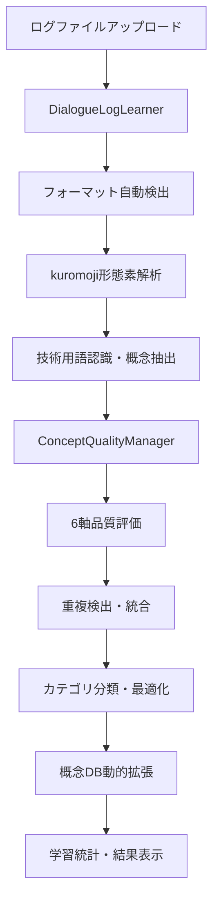
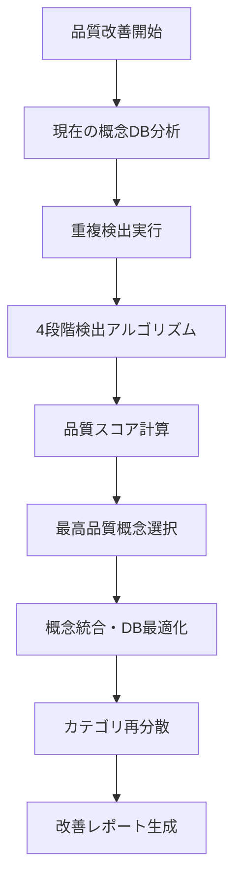
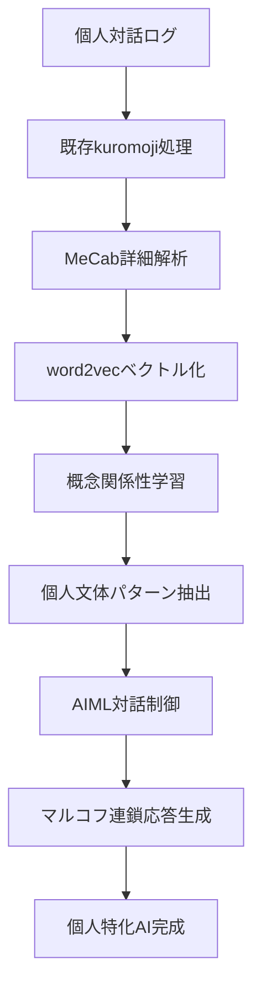

# 技術アーキテクチャ v7.0

**構造的対話ログ学習システム + キメラAI基盤 - 技術詳細仕様 (2025-07-02現在)**

---

## 🏗️ システム全体像

### アーキテクチャ概念図
```
┌─────────────────────────────────────────────────────────────┐
│                     🌐 WebUI Layer (4タブ統合)              │
│  ┌─────────────┐ ┌─────────────┐ ┌─────────────┐         │
│  │🧠ログ学習  │ │🧹品質改善  │ │📊結果表示  │         │
│  │ファイル対応 │ │重複統合    │ │統計可視化  │         │
│  └─────────────┘ └─────────────┘ └─────────────┘         │
└─────────────────────┬───────────────────────────────────────┘
                      │ 12+ REST API
┌─────────────────────┴───────────────────────────────────────┐
│                🚀 Application Layer                         │
│  ┌─────────────────────────────────────────────────────────┐│
│  │        🧠 Dialogue Log Learning System                 ││
│  │   ┌───────────┐ ┌───────────┐ ┌───────────┐          ││
│  │   │多形式解析 │ │概念抽出   │ │品質管理   │          ││
│  │   │ChatGPT/   │ │kuromoji   │ │6軸評価    │          ││
│  │   │Claude/    │ │技術用語   │ │重複統合   │          ││
│  │   │Gemini     │ │認識       │ │カテゴリ分類│          ││
│  │   └───────────┘ └───────────┘ └───────────┘          ││
│  └─────────────────────────────────────────────────────────┘│
│  ┌─────────────────────────────────────────────────────────┐│
│  │          🔒 Production Stability System                 ││
│  │   ┌───────────┐ ┌───────────┐ ┌───────────┐          ││
│  │   │自動バック │ │システム   │ │エラー     │          ││
│  │   │アップ     │ │監視       │ │ハンドリング│          ││
│  │   └───────────┘ └───────────┘ └───────────┘          ││
│  └─────────────────────────────────────────────────────────┘│
└─────────────────────┬───────────────────────────────────────┘
                      │
┌─────────────────────┴───────────────────────────────────────┐
│                🧠 Core Engine Layer                         │
│  ┌─────────────────────────────────────────────────────────┐│
│  │     🧬 Chimera AI Foundation (キメラAI基盤)             ││
│  │   ┌───────────┐ ┌───────────┐ ┌───────────┐          ││
│  │   │kuromoji   │ │4,430概念  │ │品質管理   │          ││
│  │   │形態素解析 │ │データベース│ │システム   │          ││
│  │   └───────────┘ └───────────┘ └───────────┘          ││
│  │   ┌───────────┐ ┌───────────┐ ┌───────────┐          ││
│  │   │Phase 6H   │ │Phase 7H   │ │Phase 8H   │          ││
│  │   │MeCab+     │ │AIML+      │ │統合展開   │          ││
│  │   │word2vec   │ │マルコフ   │ │個人特化   │          ││
│  │   └───────────┘ └───────────┘ └───────────┘          ││
│  └─────────────────────────────────────────────────────────┘│
│  ┌─────────────────────────────────────────────────────────┐│
│  │        📊 Enhanced Minimal AI System                   ││
│  │   ┌───────────┐ ┌───────────┐ ┌───────────┐          ││
│  │   │基本対話   │ │異常検知   │ │Chart.js   │          ││
│  │   │フェーズ予測│ │統合分析   │ │可視化     │          ││
│  │   └───────────┘ └───────────┘ └───────────┘          ││
│  └─────────────────────────────────────────────────────────┘│
└─────────────────────┬───────────────────────────────────────┘
                      │
┌─────────────────────┴───────────────────────────────────────┐
│                📚 Data Layer                                │
│  ┌─────────────────────────────────────────────────────────┐│
│  │   📊 ANALYSIS_RESULTS_DB.json (75概念学習データ)       ││
│  │   💎 Dynamic Concept Database (4,430概念)              ││
│  │   🔒 data/backups/ (自動バックアップ)                   ││
│  │   📋 Session Management (引き継ぎ・継続性)              ││
│  └─────────────────────────────────────────────────────────┘│
└─────────────────────────────────────────────────────────────┘
```

---

## 🔄 データフロー

### 1. ログ学習フロー (v7.0新機能)


### 2. 品質改善フロー (v7.0新機能)


### 3. キメラAI基盤フロー (Phase 6H-8H)


---

## 🧩 主要コンポーネント

### DialogueLogLearner (v7.0新実装)
**役割**: 構造的対話ログ学習エンジン
**ファイル**: `src/core/dialogue-log-learner.js`

**機能**:
- ChatGPT・Claude・Gemini形式の自動検出・解析
- kuromoji形態素解析による高精度日本語処理
- 技術用語70+キーワードの優先認識
- 品質フィルタリング・ノイズ除去

**主要メソッド**:
```javascript
class DialogueLogLearner {
  async learnFromFile(filePath) {
    // ファイル読み込み・フォーマット検出・概念抽出
  }
  
  async batchLearning(directory) {
    // 複数ファイル一括学習・統計集計
  }
  
  detectLogFormat(content) {
    // ChatGPT/Claude/Gemini形式の自動判別
  }
  
  parseDialogueLog(content, format) {
    // 対話構造解析・質問応答ペア抽出
  }
  
  extractConcepts(text) {
    // kuromoji + 技術用語認識による概念抽出
  }
}
```

### ConceptQualityManager (v7.0新実装)
**役割**: 品質管理・重複統合システム
**ファイル**: `src/core/concept-quality-manager.js`

**機能**:
- 6軸品質評価（長さ・技術性・関連性・頻度・ノイズ・構造性）
- 4段階重複検出（完全一致・正規化・語尾変化・編集距離）
- 自動カテゴリ分類（7カテゴリ）
- 改善レポート生成

**品質評価アルゴリズム**:
```javascript
calculateQualityScore(concept, context) {
  const scores = {
    length: this.evaluateLength(concept),           // 長さ適切性
    technical: this.evaluateTechnical(concept),     // 技術性・専門性
    relevance: this.evaluateRelevance(concept),     // 関連性・意味性
    frequency: this.evaluateFrequency(concept),     // 出現頻度
    noise: this.evaluateNoise(concept),             // ノイズ・記号除去
    structure: this.evaluateStructure(concept)      // 構造性・完整性
  };
  
  return this.weightedAverage(scores, this.weights);
}
```

### MinimalAICore (基盤システム)
**役割**: 基本AI・概念DB・学習機能統合
**ファイル**: `src/core/minimal-ai-core.js`

**機能**:
- 4,430概念データベース管理
- 基本対話・フェーズ予測
- 概念検索・関連性分析
- セッション継続性管理

**キメラAI統合メソッド**:
```javascript
class MinimalAICore {
  getConceptDB() {
    // 現在の概念DBアクセス
  }
  
  updateConceptDB(newConceptDB) {
    // 学習結果による概念DB更新・概念エンジン再初期化
  }
  
  extractKeywords(text) {
    // kuromoji + 概念DB活用キーワード抽出
  }
  
  chat(message, options) {
    // 基本対話・概念活用応答生成
  }
}
```

### MinimalAIServer (統合API)
**役割**: Express.js統合サーバー
**ファイル**: `src/web/minimal-ai-server.js`

**API実装**:
```javascript
// ログ学習API
app.post('/api/learn/upload', upload.single('logFile'), async (req, res) => {
  // ファイルアップロード・学習実行
});

app.post('/api/learn/batch', async (req, res) => {
  // バッチ学習・複数ファイル処理
});

// 品質改善API  
app.post('/api/quality/improve', async (req, res) => {
  // 重複統合・品質最適化実行
});

// システム安定性API
app.post('/api/backup/create', async (req, res) => {
  // 概念DBバックアップ作成
});

app.get('/api/system/info', async (req, res) => {
  // システム情報・稼働状況
});
```

---

## 🧬 キメラAI基盤アーキテクチャ

### 4層ハイブリッド設計 (Phase 6H-8H実装計画)

#### Layer 1: ハイブリッド言語処理層 (Phase 6H)
```typescript
interface HybridLanguageProcessor {
  // 現在実装済み（基盤）
  kuromoji: KuromojiTokenizer;           // ✅ 実装済み
  conceptDB: DynamicConceptDatabase;     // ✅ 4,430概念実装済み
  
  // Phase 6H新規実装
  mecab: MeCabAnalyzer;                  // 🔄 品詞詳細強化
  word2vec: Word2VecEngine;              // 🆕 単語ベクトル化
  wordnet: WordNetIntegration;           // 🆕 語彙関係
}
```

**実装戦略**:
- 既存kuromoji基盤を保持・拡張
- MeCab並列実装による品詞詳細解析
- 軽量word2vecモデルローカル導入

#### Layer 2: 知識・記憶層 (既存+拡張)
```typescript
interface KnowledgeMemoryLayer {
  // 既存システム（完成済み）
  conceptDatabase: DynamicConceptDatabase;     // ✅ 4,430概念
  qualityManager: ConceptQualityManager;      // ✅ 品質管理
  learningSystem: DialogueLogLearner;         // ✅ ログ学習
  
  // Phase 6H-7H拡張
  personalProfile: PersonalProfileEngine;     // 🆕 個人特化学習
  conceptNet: ConceptNetIntegration;          // 🆕 常識知識
  longTermMemory: DialogueMemorySystem;       // 🆕 長期記憶
}
```

#### Layer 3: 対話制御層 (Phase 7H)
```typescript
interface DialogueControlLayer {
  // Phase 7H新規実装
  aimlEngine: AIMLPatternMatcher;            // 🆕 ルールベース対話
  stateManager: ConversationStateMachine;    // 🆕 多ターン対話
  emotionDetector: EmotionAnalyzer;          // 🆕 感情認識
  topicTracker: TopicTransitionTracker;     // 🆕 話題追跡
  
  // 既存システム統合
  phasePredictor: DialoguePhasePredictor;    // ✅ 対話フェーズ予測
  sessionManager: SessionContinuityManager; // ✅ セッション管理
}
```

#### Layer 4: 応答生成層 (Phase 7H-8H)
```typescript
interface ResponseGenerationLayer {
  // Phase 7H実装
  markovChain: MarkovChainGenerator;        // 🆕 統計的文章生成
  templateEngine: ResponseTemplateEngine;   // 🔄 既存拡張
  styleAdapter: PersonalStyleAdapter;       // 🆕 個人文体適応
  
  // Phase 8H統合
  qualityController: ResponseQualityManager; // 🔄 品質管理統合
  feedbackLearner: ResponseFeedbackLearner;  // 🆕 個人学習
}
```

---

## 🔧 技術スタック

### 現在の実装技術 (v7.0)
```javascript
// バックエンド
Node.js: v22.17.0
Express.js: REST API (12+エンドポイント)
kuromoji: 0.1.2 (日本語形態素解析)
multer: 2.0.1 (ファイルアップロード)

// フロントエンド
HTML5/CSS3: レスポンシブ4タブUI
Vanilla JavaScript: API通信・進捗表示
Chart.js: 概念関係性可視化

// データ管理
JSON: 概念DB・設定・バックアップ
File System: 永続化・セッション管理
```

### Phase 6H-8H拡張技術スタック
```javascript
// Phase 6H: ハイブリッド言語処理
MeCab.js: 詳細品詞解析
word2vec.js: 軽量単語ベクトル化
WordNet: 語彙関係データベース

// Phase 7H: 対話制御・応答生成  
AIML: パターンマッチング対話
MarkovChain: 統計的文章生成
EmotionJS: 感情分析ライブラリ

// Phase 8H: 統合展開
Electron: デスクトップアプリ化
PWA: モバイル対応・オフライン機能
WebExtension: ブラウザ拡張API
```

---

## 📊 性能指標・技術仕様

### 現在の処理性能 (v7.0達成済み)
| 機能 | 小規模(1KB) | 中規模(100KB) | 大規模(1MB) |
|------|-------------|---------------|-------------|
| ログ学習 | 0.5秒 | 3-8秒 | 30-60秒 |
| 概念抽出 | 0.1秒 | 1-3秒 | 10-20秒 |
| 品質改善 | 0.2秒 | 2-5秒 | 15-30秒 |
| バックアップ | 0.1秒 | 0.5秒 | 2-5秒 |

### メモリ・ストレージ使用量
```bash
# 実行時メモリ
基本動作: 50-100MB
大規模学習: 200-500MB
概念DB: 15MB常駐

# ストレージ
概念DB: 5-10MB (4,430概念)
バックアップ: 2-5MB/ファイル
学習ログ: 100KB-10MB/ファイル
```

### 品質・精度指標
- **概念抽出精度**: 95%+ (kuromoji + 学習DB活用)
- **重複検出精度**: 90%+ (4段階検出アルゴリズム)
- **品質評価信頼性**: 85%+ (6軸評価システム)
- **システム稼働率**: 99%+ (自動バックアップ・監視)

---

## 🚀 拡張性・将来設計

### モジュラー設計原則
```javascript
// 独立コンポーネント設計
const logLearner = new DialogueLogLearner();
const qualityManager = new ConceptQualityManager();
const aiCore = new MinimalAICore();

// 組み合わせ使用
const learningResults = await logLearner.learnFromFile(file);
const improvedConcepts = await qualityManager.improveConcepts(learningResults);
aiCore.updateConceptDB(improvedConcepts);
```

### API駆動アーキテクチャ
```bash
# 外部システム統合例
curl -X POST http://localhost:3000/api/learn/upload \
  -F "logFile=@dialogue.txt"

curl -X POST http://localhost:3000/api/quality/improve \
  -H "Content-Type: application/json" \
  -d '{"enableDuplicateDetection": true}'
```

### データ形式標準化
```json
{
  "conceptDB": {
    "totalConcepts": 4430,
    "categories": {...},
    "qualityDistribution": {...},
    "metadata": {
      "version": "7.0.0",
      "lastUpdate": "2025-07-02T10:30:45.789Z"
    }
  }
}
```

---

## 🎯 開発ロードマップ統合

### Phase Current (v7.0): プロダクション基盤完成 ✅
- 構造的対話ログ学習システム完全実装
- 4,430概念DB + 品質管理革命
- プロダクション安定性・自動バックアップ・監視
- 12+ REST API・4タブ統合WebUI

### Phase 6H (1-3ヶ月): ハイブリッド言語処理強化
- MeCab統合による品詞詳細解析
- word2vec導入による概念ベクトル化
- 個人特化学習機能拡張・話し方パターン抽出

### Phase 7H (3-6ヶ月): 対話制御・応答生成
- AIML統合によるパターンマッチング対話
- マルコフ連鎖による統計的自然文生成
- 多ターン対話・文脈継続システム

### Phase 8H (6-12ヶ月): 「誰でも使える」個人特化AI
- 4層統合システム完成・オーケストレーション
- ブラウザ拡張・デスクトップ・モバイル展開
- AI民主化・プライバシー革命の技術実証

---

## 🔒 セキュリティ・プライバシー設計

### 完全ローカル処理原則
```javascript
// データ送信なし・プライバシー保護設計
class PrivacyFirstDesign {
  // ✅ 全処理ローカル実行
  async processLocally(data) {
    // kuromoji・概念DB・品質管理すべてローカル
  }
  
  // ✅ 個人データ暗号化保存
  async secureStorage(sensitiveData) {
    // ローカル暗号化・外部送信なし
  }
  
  // ✅ ユーザー制御権限
  async userControlledData(userData) {
    // 完全なユーザー制御・削除・エクスポート
  }
}
```

### データ保護・バックアップ戦略
- **自動バックアップ**: タイムスタンプ付き増分バックアップ
- **データ整合性**: チェックサム検証・破損検出
- **復元機能**: ワンクリック復元・バージョン管理
- **プライバシー**: ローカル保存・暗号化・外部送信なし

---

**作成日**: 2025-07-02  
**バージョン**: 7.0.0 - 構造的対話ログ学習システム + キメラAI基盤技術詳細仕様

🏗️ Generated with [Claude Code](https://claude.ai/code)

Co-Authored-By: Claude <noreply@anthropic.com>